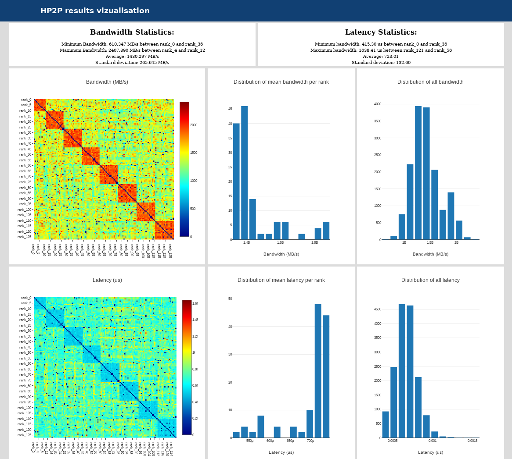

# HP2P

**HP2P** (Heavy Peer To Peer) benchmark is a test which performs MPI Point-to-Point non-blocking communications between all MPI processes. Its goal is to measure the bandwidths and the latencies in a situation where the network is busy. This benchmark can help to detect network problems like congestions or problems with switches or links.

The benchmark generates an HTML output with interactive visualisation with Plotly.



New: HTML report can be generated instead of Python GUI for portability. The following link gives an example of a report.

[Plotly example](http://htmlpreview.github.io/?https://github.com/cea-hpc/hp2p/blob/master/examples/plotly_example.html)

## Prerequisites

Main program:

* C++ compiler
* MPI

## Getting started

```
$ ./autogen.sh
$ ./configure --prefix=<path-to-install>
$ make
$ make install
```
The program **hp2p.exe** is generated.

## Running HP2P

```
$ hp2p.exe -h
Usage: ./hp2p.exe [-h] [-n nit] [-k freq] [-m nb_msg]
       [-s msg_size] [-o output] [-a align] [-y]
       [-p file]       [-i conf_file]
       [-f bin|html] [-M max_comm_time] [-X mult_time]
Options:
   -i conf_file       Configuration file
   -n nit             Number of iterations
   -k freq            Iterations between snapshot
   -s msg_size        Message size
   -m nb_msg          Number of msg per comm
   -a align           Alignment size for MPI buffer (default=8)
   -t max_time        Max duration
   -c build           Algorithm to build couple
                      (random = 0 (default), mirroring shift = 1)
   -y anon            1 = hide hostname, 0 = write hostname (default)
   -p jsfile          Path to a plotly.min.js file to include into HTML
                      Use get_plotlyjs.py script if plotly is installed
                      in your Python distribution
   -o output          Output file
   -f format          Output format (binary format = bin, plotly
                      format = html) [default: html]
   -M max_comm_time   If set, print a warning each time a
                      communication pair is slower than 
                      max_comm_time
   -X mult_time       If set, print a warning each time a
                      communication pair is slower than 
                      mult_time * mean of previous
                      communication times
```
The program is written in MPI:
```
 $ mpirun -n 32 ./hp2p.exe -n 1000 -s 1024 -m 10 -b 1 -o first_test -o output.html
```
This command will launch the benchmark on 32 MPI processes and will run 1000 iterations. An iteration consists on a draw of random couples of MPI processes and then a phase where 10 successive communications of 1024 bytes will be performed.
The benchmark aims to test the network, so it is better to launch the benchmark with 1 MPI process per node.
At the end of the execution, the output.html file wan be viewed with a web browser.

## Using CUDA

### Compilation

```
$ ./configure --enable-cuda --with-cuda=${CUDA_ROOT}
$ make
$ make install
```

### Running

hp2p should be launched with one MPI process for one GPU. If you have 4 GPUs on one node, you should launch 4 MPI processes on the node. 

## Using UNIX signals

Signals can be sent to one of hp2p processes to make the program generate an output:

### Compilation

```
$ ./configure --enable-signal
$ make
$ make install
```

### Running

```
$ mpirun -n 32 ./hp2p.exe -n 1000 -s 1024 -m 10 -b 1 -o first_test -o output.html

$ kill -s SIGUSR1 <hp2p process PID> # make hp2p generate an output

$ kill -s SIGTERM <hp2p process PID> # make hp2p generate an output and exit
```


## Contributing
## Authors
See the list of [AUTHORS](AUTHORS) who participated in this project.
## Contact

Laurent Nguyen - <laurent.nguyen@cea.fr>

## Website

[CEA-HPC](http://www-hpc.cea.fr/)

## License

Copyright 2010-2022 CEA/DAM/DIF<br />
<br />
HP2P is distributed under the CeCILL-C. See the included files <br />
Licence_CeCILL-C_V1-en.txt (English version) and <br />
Licence_CeCILL-C_V1-fr.txt (French version) or visit  <br />
http://www.cecill.info for details.

## Notes

The benchmark is similar to the FZ-Juelich [linktest](https://www.fz-juelich.de/en/ias/jsc/services/user-support/jsc-software-tools/linktest) benchmark.
